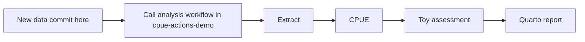

# Synthetic data that trigger another repository's analysis

This public repository holds a small **entirely synthetic** SQLite fishery database.
It contains no real vessel, location, member, or confidential fishery records.

A change to `data/` starts this repository's GitHub Actions workflow. That workflow
calls the version-pinned reusable workflow in
[cpue-actions-demo](https://github.com/kyuhank/cpue-actions-demo):



Runs and artifacts appear in **this data repository's Actions tab** because it is
the caller. Within the called workflow, four dependent jobs run sequentially.
This is a cross-repository reusable workflow, not a chain of four separate
repository-dispatch events. It uses the standard read-only `GITHUB_TOKEN`; no
cross-repository personal-access-token secret is needed for the public workflow.

## Add a synthetic year

```bash
python3 scripts/add_year.py --append
git add data/toy-fishery.sqlite
git commit -m "Add one synthetic year"
git push
```

The new commit is the event: no manual Actions click is required. Use **Re-run all
jobs** when repeating a workflow attempt so all four artifacts share its attempt
number. Workflow dispatch can repeat the current data version.

The models compare two CPUE specifications and then fit a tiny biomass model.
They are teaching examples, not a tuna stock assessment or management advice.

Kflow2 and the private presentation viewer are not included in either public
repository. All calculations and the report can be inspected directly in GitHub.
